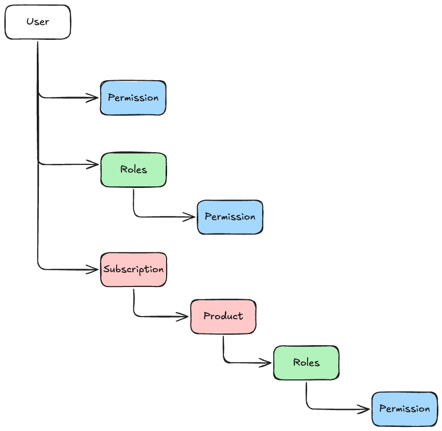
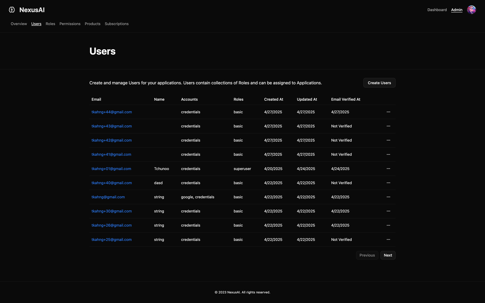
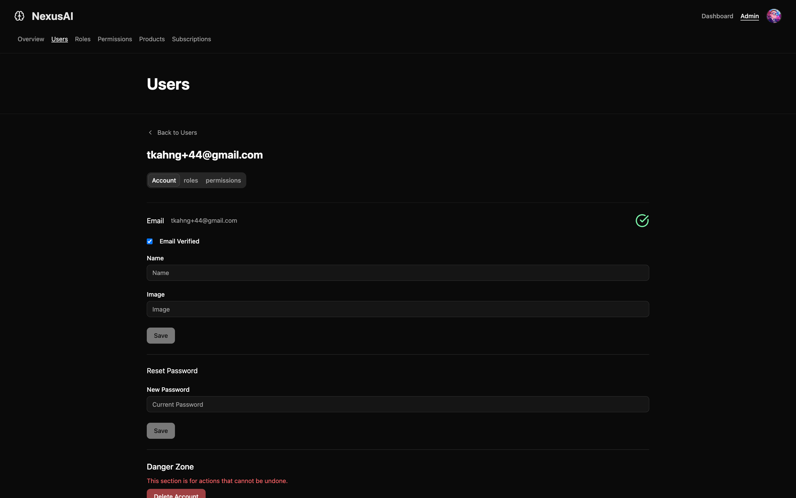
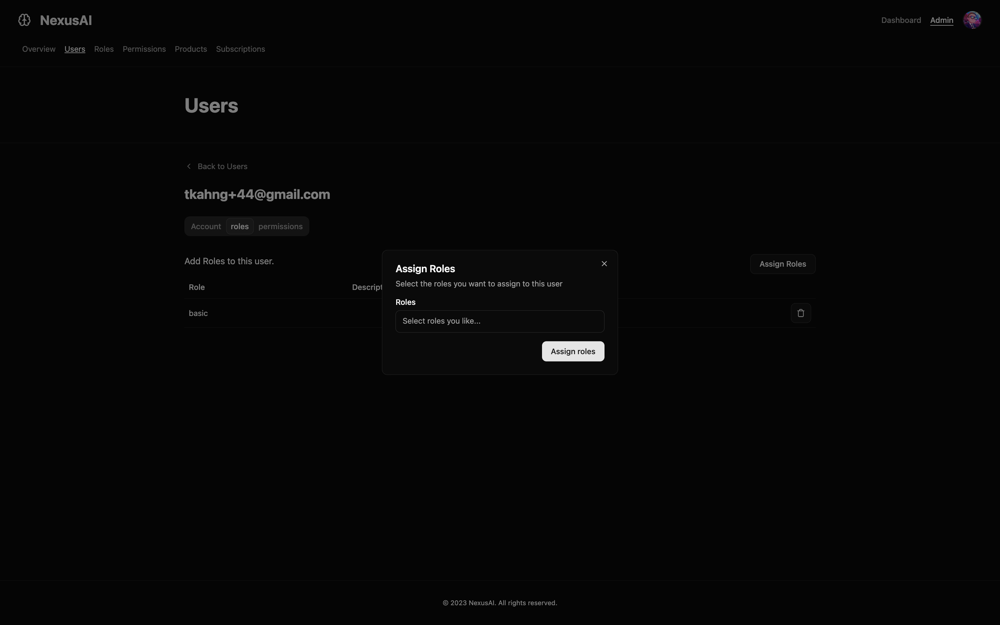

# authgo

# Introduction

# Authentication

Currently there are 3 ways of authentication, `credentials`, `google`, and `github`. Users who signup through credentials must verify their email. Users who signup through google or github are automatically verified.

## Credentials

Email and password authentication is supported, along with change password, reset password and verify email features.

## OAuth2.0

Google and Github oauth is supported, with more supported with adding configuration.

Inspired by Supabase's [GoTrue](https://github.com/supabase/auth), a unified endpoint for OAuth2.0 Callbacks with state token is used. All providers point to `/api/auth/callback`, with each state parameter containing a jwt with necessary information for authentication.

# Projects and Tasks

# Permission Model

There are multiple ways a user can have permissions.

- Direct Assignment
- Assigning Roles
- Subscription to Product with Roles

Authorization happens on the set of all permissions assigned to a user.

# Admin Features

- Users

  - create user
  - edit user
  - update user password
  - assign roles to user
  - assign permissions to user
  - view users
  - delete users

- Roles

  - view roles
  - create roles
  - edit roles
  - assign permissions to roles
  - delete roles

- Permissions

  - view permissions
  - create permissions
  - delete permissions

- Products

  - view products
  - assign product roles

- Subscriptions

  - view subscriptions

- Users

  - user management
  -

- Roles

  - view roles
  - create roles
  - edit roles
  - assign permissions to roles
  - delete roles

- Permissions

  - view permissions
  - create permissions
  - delete permissions

- Products

  - view products
  - assign product roles

- Subscriptions

  - view subscriptions

## User Management

|  |  |  |
| ---------------------------------- | ---------------------------------- | ------------------------------------------- |
| user list                          | user edit                          | user roles                                  |
