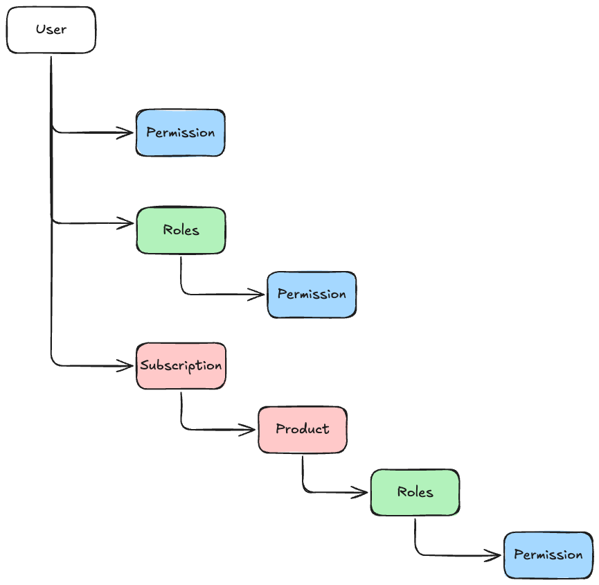
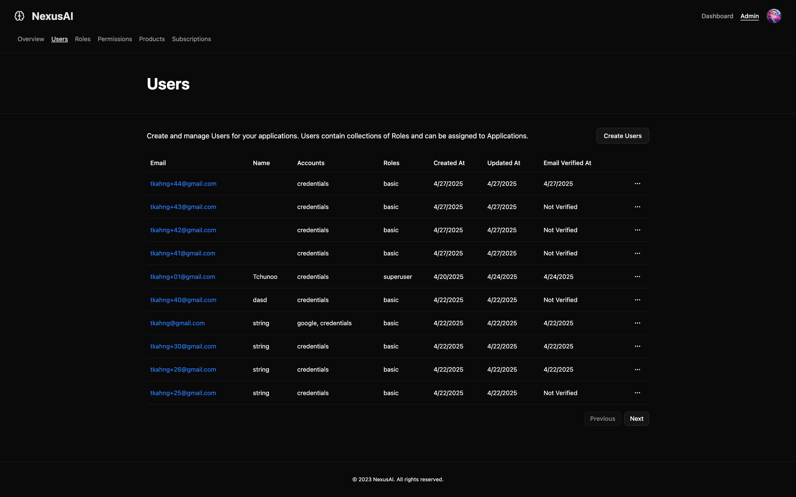
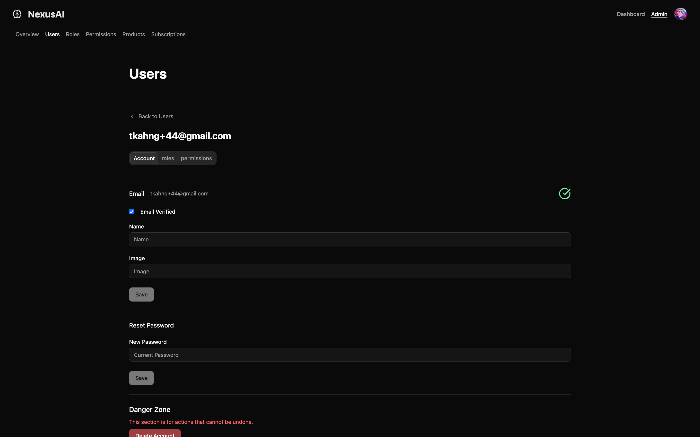
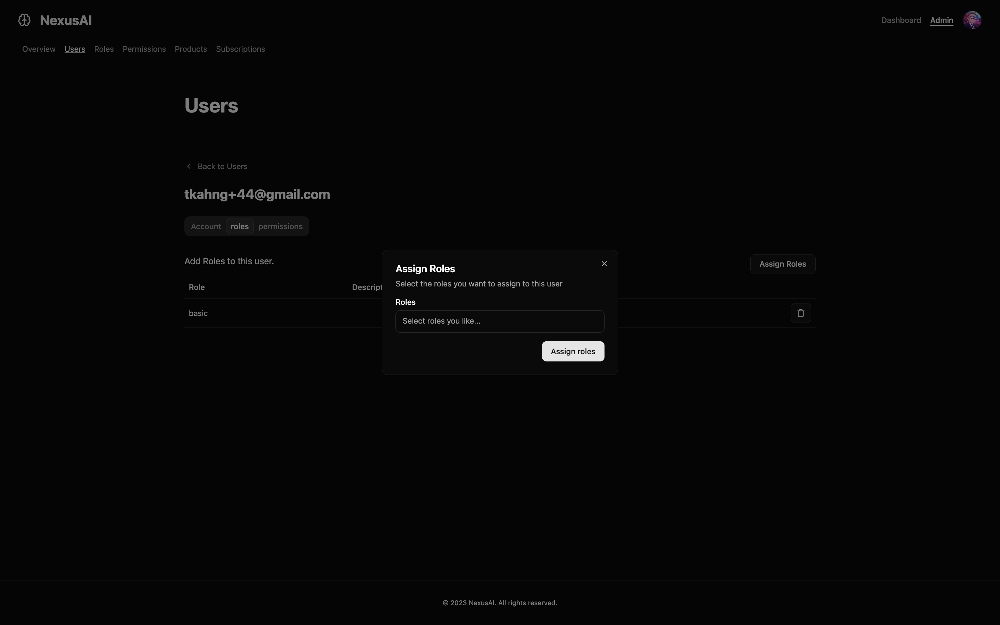

# Playground

# Features

- Admin
  - User Management
  - Permission and Role Management
- Teams
  - Create or join teams.
  - Invite other users to join your team.
- Tasks and Projects
  - Teams can create projects, which are collection of tasks.
  - Drag and drop kanban board.
  - Realtime task due alerts
- Realtime notifications through SSE
  - when new users join your team
  - when a task you are following is due
  - when a task you are following is

# Introduction

# Authentication

Currently there are 3 ways of authentication, `credentials`, `google`, and `github`. Users who signup through credentials must verify their email. Users who signup through google or github are automatically verified.

## Credentials

Email and password authentication is supported, along with change password, reset password and verify email features.

## OAuth2.0

Google and Github oauth is supported, with more supported with adding configuration.

Inspired by Supabase's [GoTrue](https://github.com/supabase/auth), a unified endpoint for OAuth2.0 Callbacks with state token is used. All providers point to `/api/auth/callback`, with each state parameter containing a jwt with necessary information for authentication.

# Points

Users can purchase points via Stripe and spend them on in-app features such as wagering on RPS games.

Points are stored in a double-entry ledger. Each user has a wallet account; transfers between accounts are atomic and enforce a no-overdraft constraint.

**Purchasing points**

Points are sold as one-time Stripe products. Each Stripe price must have a `points_amount` metadata key containing the integer number of points granted. The server derives the grant from this metadata — the client only supplies a `price_id`. After Stripe confirms payment via webhook, the points are credited to the user's wallet automatically.

**Wagering on RPS games**

When requesting a game, the host may set a `bet_amount`. The host's points are held in escrow immediately. When the guest responds, the guest's points are also debited and the pot is awarded to the winner (or returned to both on a tie). If the guest declines, the host's escrow is refunded in full.

# Projects and Tasks

# Permission Model

There are multiple ways a user can have permissions.

- Direct Assignment
- Assigning Roles
- Subscription to Product with Roles

Authorization happens on the set of all permissions assigned to a user.

# Admin Features

## Feature list

- Users

  - create user
  - edit user
  - update user password
  - assign roles to user
  - assign permissions to user
  - view users
  - delete users

- Roles

  - view roles
  - create roles
  - edit roles
  - assign permissions to roles
  - delete roles

- Permissions

  - view permissions
  - create permissions
  - delete permissions

- Products

  - view products
  - assign product roles

- Subscriptions

  - view subscriptions

- Users

  - user management
  -

- Roles

  - view roles
  - create roles
  - edit roles
  - assign permissions to roles
  - delete roles

- Permissions

  - view permissions
  - create permissions
  - delete permissions

- Products

  - view products
  - assign product roles

- Subscriptions

  - view subscriptions

## User Management

|  |  |  |
| ---------------------------------- | ---------------------------------- | ------------------------------------------- |
| user list                          | user edit                          | user roles                                  |

# UI flows

## team invitations

### new user

1. User is invited.
2. User clicks on the invitation link.
3. User is redirected to the signup page. The invitation page and its paramaters are all passed as a redirect_to parameter to the signup page, along with the email of the user to preset the form with the correct email.
4. User signs up (e.g., with email/password or OAuth).
5. If signed up with email/password, user is redirected to verify their email otp form, along with other query parameters.
6. user provides the otp from mail, verifies, then redirects to the destination in the redirect_to parameter.
